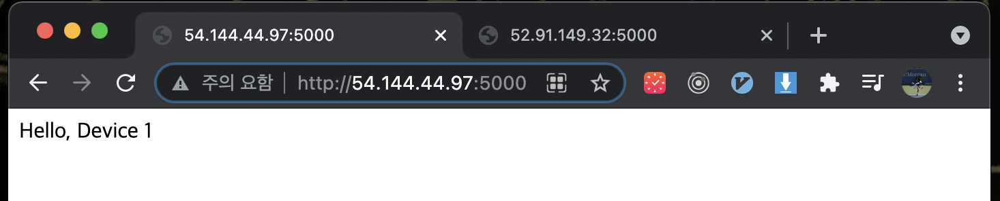
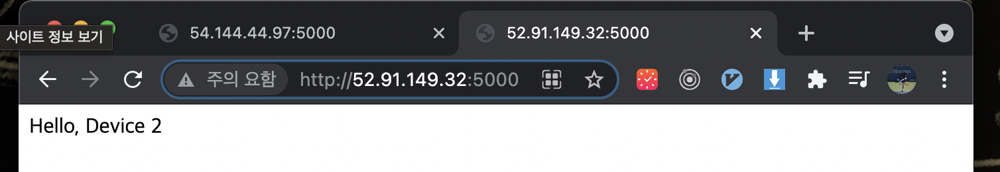

# Federated Learning

### 2021.06.01

AWS에 환경설정을 하긴 했지만 일단 local에서 두 모델의 weight를 합치는 과정을 먼저 이해하고 해야겠다.

개 고양이 데이터를 적절히 나누어 보았다. 괄호안의 숫자는 데이터셋의 갯수이다.

```bash
├── alpha
│   └── train
│       ├── cat (10)
│       └── dog (70)
├── beta
│   └── train
│       ├── cat (70)
│       └── dog (10)
└── test
    ├── cat (20)
    └── dog (20)
```

alpha에 있는 데이터로 학습하고 beta에 있는 데이터로 학습해서 test폴더로 각각의 모델을 평가한다. 그리고 두 모델을 합친다음 test로 평가한다.


**결과가 성공적이다~~**

모델 Alpha의 학습

```
Epoch : 1 / 3
---------------
1 Loss : 0.4383 Acc : 0.8625
1 Loss : 0.3382 Acc : 0.8974
Epoch : 2 / 3
---------------
2 Loss : 0.1539 Acc : 0.9500
2 Loss : 0.7020 Acc : 0.7949
Epoch : 3 / 3
---------------
3 Loss : 0.0609 Acc : 0.9875
3 Loss : 0.1981 Acc : 0.8974
Train Complete in 1m 41.2099s
Best Acc : 0.8974
```

모델 Beta의 학습

```
Epoch : 1 / 3
---------------
1 Loss : 0.2150 Acc : 0.9000
1 Loss : 0.3413 Acc : 0.8462
Epoch : 2 / 3
---------------
2 Loss : 0.0784 Acc : 0.9875
2 Loss : 0.4025 Acc : 0.8205
Epoch : 3 / 3
---------------
3 Loss : 0.0368 Acc : 1.0000
3 Loss : 0.2696 Acc : 0.8718
Train Complete in 1m 41.3656s
Best Acc : 0.8718
```


학습하지 않은 base model의 evaluate

```
Epoch : 1 / 3
---------------
1 Loss : 0.7795 Acc : 0.4359
Epoch : 2 / 3
---------------
2 Loss : 0.7795 Acc : 0.4359
Epoch : 3 / 3
---------------
3 Loss : 0.7795 Acc : 0.4359
Train Complete in 0m 17.4660s
Best Acc : 0.4359
```


모델 Alpha와 모델 Beta를 합친 후 model의 evaluate

```
Epoch : 1 / 3
---------------
1 Loss : 0.2696 Acc : 0.8718
Epoch : 2 / 3
---------------
2 Loss : 0.2696 Acc : 0.8718
Epoch : 3 / 3
---------------
3 Loss : 0.2696 Acc : 0.8718
Train Complete in 0m 17.3913s
Best Acc : 0.8718
```


가중치는 합치는 코드는 다음과 같다.

```python
sd_alpha = model_alpha.state_dict()
sd_beta = model_beta.state_dict()

for key in sd_alpha:
    sd_beta[key] = (sd_beta[key] + sd_alpha[key]) / 2.

model_base.load_state_dict(sd_beta)
```

[참조한 사이트](https://discuss.pytorch.org/t/average-each-weight-of-two-models/77008)


### 2021.05.31

1개의 Main Server

2개의 Device


2개의 Device를 AWS에서 환경구축

Flask로 모델결과를 Main Server로 전송


AWS 환경 구축 단계

Instace : Ubuntu 20.04

**1. 우분투 패키지 업데이트 & Pip 설치**

```bash
sudo apt update && sudo apt upgrade -y && sudo apt autoremove -y
sudo apt install python3-pip
# python3 는 설치되어 있더라?
```


**2. Flask, PyTorch Install**

```bash
pip3 install flask
pip3 install torch==1.8.1+cpu torchvision==0.9.1+cpu torchaudio==0.8.1 -f https://download.pytorch.org/whl/torch_stable.html
```


*alias 설정*  (python3라고 계속치기 너무 귀찮더라...)

add in ~/.bashrc

```bash
alias python="python3"
```

```bash
source ~/.bashrc # bashrc 적용
```


app.py (Device 1)

```python
from flask import Flask
app = Flask(__name__)

@app.route('/')
def hello_world():
    return 'Hello, Device 1'


if __name__ == "__main__":
    app.run(host="0.0.0.0", port="5000", debug=True)
```







이제 Model을 학습하고 Weight 값을 Return 하자!


학습할 데이터로는 [Dogs vs. Cats](https://www.kaggle.com/c/dogs-vs-cats-redux-kernels-edition/data?select=train.zip)로 선택했다. 다운받은 train.zip이 개 고양이 폴더 분류 없이 파일명으로 dog.1.jpg cat.1.jpg 형태로 되어 있어서 다음과 같이 폴더를 지정해주었다.

.
├── device1
│   ├── cat
│   └── dog
└── device2
    ├── cat
    └── dog

```python
import shutil
import os


base_path = './cat_dog_data/train'
all_images = os.listdir(base_path)
for i, image in enumerate(all_images):
    image_path = os.path.join(base_path, image)
    if i % 2 == 0:
        if image[0] == 'c':
            # device1 cat 으로 이동
            dst = './cat_dog/train/device1/cat/'+image
            shutil.move(image_path, dst)
        else:
            # device1 dog 으로 이동
            dst = './cat_dog/train/device1/dog/'+image
            shutil.move(image_path, dst)
    else:
        if image[0] == 'c':
            # device2 cat 으로 이동
            dst = './cat_dog/train/device2/cat/'+image
            shutil.move(image_path, dst)
        else:
            # device2 dog 으로 이동
            dst = './cat_dog/train/device2/dog/'+image
            shutil.move(image_path, dst)
        
```


​        

이제 각각 device 폴더를 aws로 보내주자.

```bash
scp -r -i ../../../pem_keys/fedeated_learning1.pem device2 ubuntu@ec2-52-91-149-32.compute-1.amazonaws.com:~/.
```

scp로 폴더를 aws로 보내는 코드인데 위의 코드는 느리다.

이미지를 1개씩 전송하기 때문에 이미지 1개당 대기시간, 완료시간이 소요되는 것 같다. zip -> scp -> unzip 의 과정을 거치는 것이 훨씬 더 빠르게 보낼 수 있었다.!!


다음단계는 Flask로 요청이 들어오면 학습을 진행하고 weight 값을 리턴하는 것이다.


